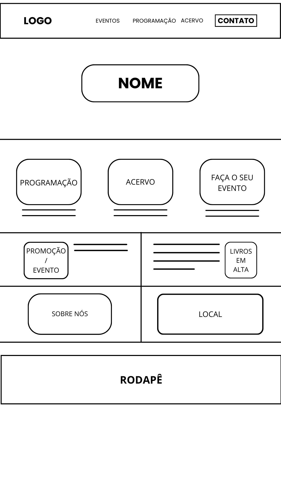
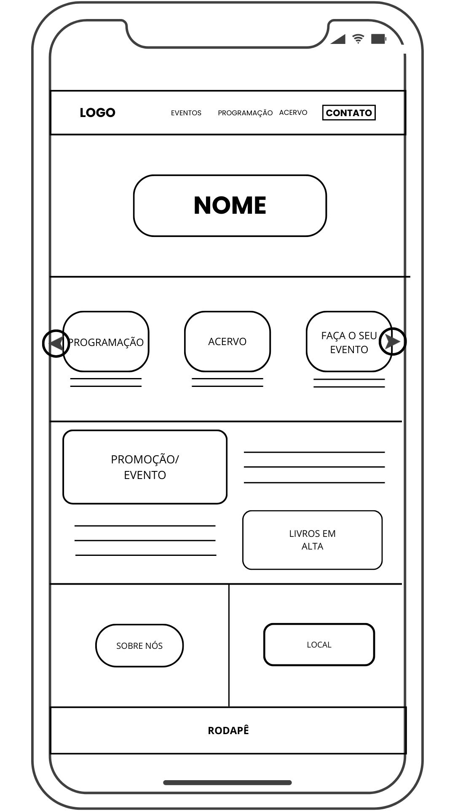
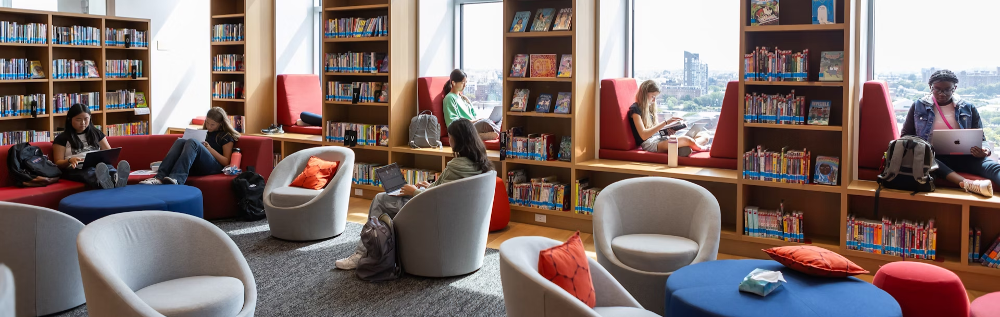
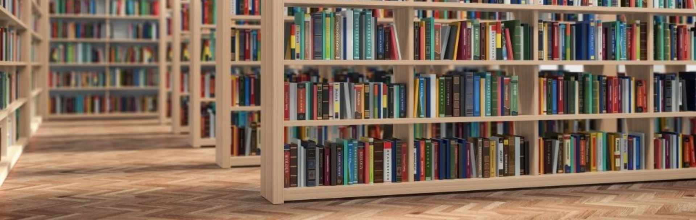
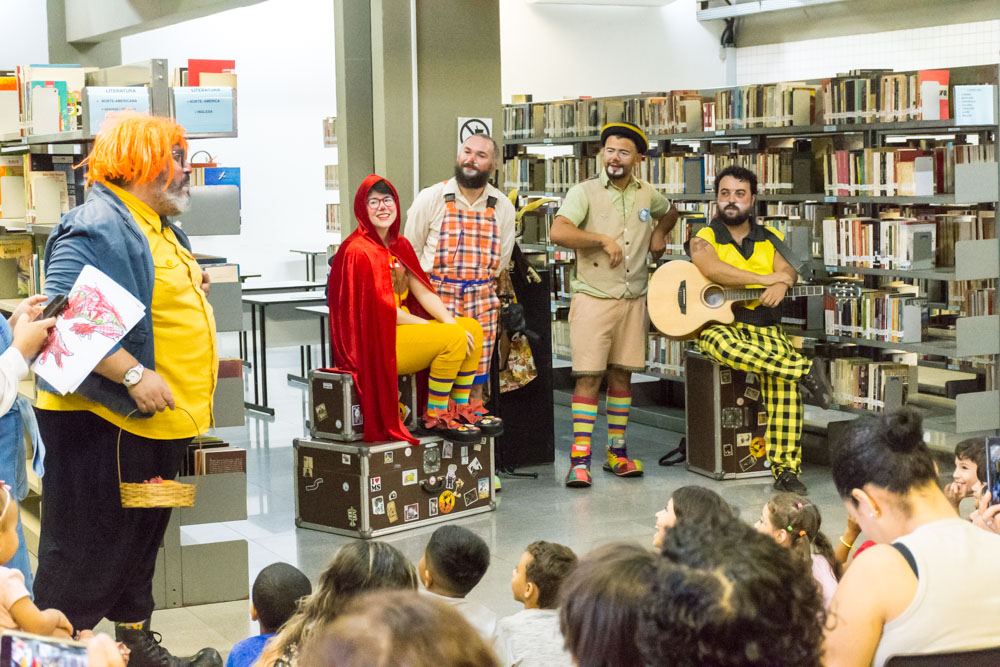
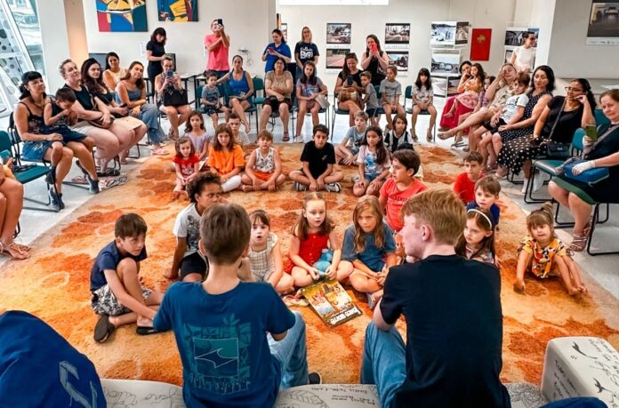
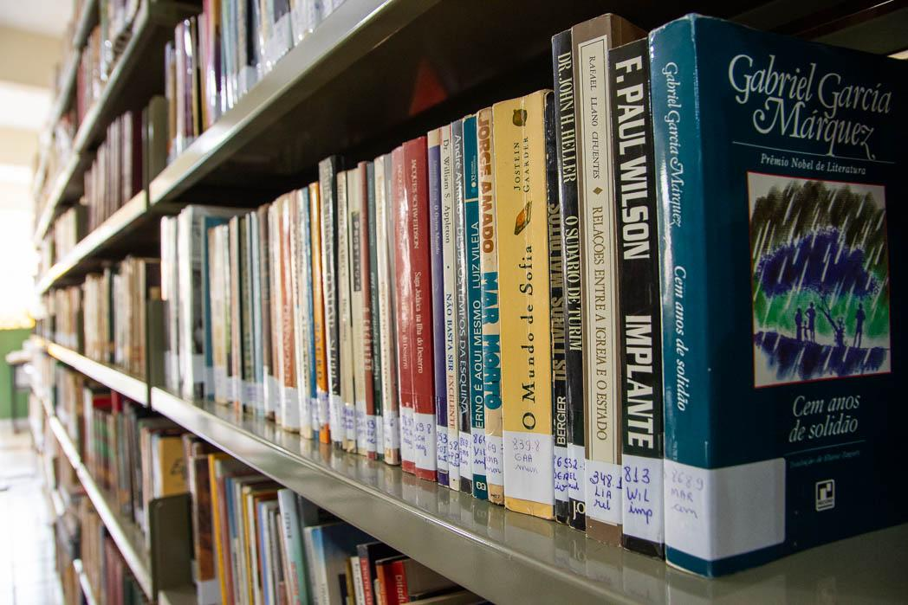

# projeto_lagarta_02H

### Alunos:

Guilherme Pinho - 10755529

Moabe da Silva Guedes Rêgo - 10748053

Ryan Silva de Sousa - 10757255

## Processo de Ideação

Inicialmente partimos de um brainstorming tentando buscar ideias relacionadas a assuntos próximos de nós, como comércios de familiares e amigos. A partir disso, expandimos esse pensamento inicial e chegamos em estabelecimentos maiores, porém, que ainda apresentam dificuldade em se adaptar a internet e essa transição entre catalogar seus produtos físicos em um campo virtual. 

Nossas principais ideias foram: Um site de brechó, visto que, muitos brechós focam em vender seu catálogo apenas em redes sociais, o que muitas vezes não passa a confiança, segurança e profissionalidade necessária que um site próprio pode passar (além de uma organização muito mais prática); e um site para bibliotecas ou sebos, que além dos pontos anteriores, também concentra outras informações relevantes sobre o local, como o seu acervo online, programação e eventos, convite para fazer o seu próprio evento, entre outros.

Por fim, como parte do grupo votou no brechó e a outra parte na biblioteca, decidimos jogar as opções em uma roda de sorteio online para ter a nossa escolha, tendo como resultado a opção da biblioteca.

## Caráter Extensionista

Escolhemos focar nos Sebos/Bibliotecas levando em consideração os que recebem grandes quantidades de livros por semanas e não possuem integração com seus serviços na web.Atuaremos em ajudar a melhorar a visibilidade, quantidade de vendas, prestígio, organização e consequentemente disponibilizar os acessos a literatura mais amplos.Nosso website irá considerar todas essas necessidades para maximar os ganhos potenciais e economia para estes tipos de comércio

##  Wireframe



## Tutorial HTML

### Head
~~~html
<!DOCTYPE html>
<html lang="pt-br">
<head>
    <meta charset="UTF-8">
    <meta name="viewport" content="width=device-width, initial-scale=1.0">
    <link rel="stylesheet" href="home.css">
	<link rel="icon" type="image/x-icon" href="">
    <title> Biblioteca </title>
</head>
~~~
Em nosso head temos as tags metas que contém as configurações de resposividade da home e das definições de caracteres especiais, links para arquivos externos que virão posteriormente e o título da página.
#### Fim do Head

### Body
#### Header (Menu)
~~~html
<header>
        
        <a href=""> EVENTOS </a>
        <a href=""> PROGRAMAÇÃO </a>
        <a href=""> ACERVO </a>
        <a href=""> CONTATO </a>
    </header>
~~~
Fizemos um header onde ficará localizado o menu da página com a logo e nesse menu teremos nossos links <a> que redirecionarão para as páginas posteriores do site.

#### Section (Plano de fundo biblioteca e Carrossel)
~~~html
<section class="carrossel">
        
        
        
    
        <button class="prev">❮</button>
        <button class="next">❯</button>
    </section>
~~~
Section contendo as 3 imagens que serão usadas para o carrossel, definindo as classes da imagem principal como ".slide ativo" (que vai estar aberto quando iniciar o site) e os restantes apenas como ".slide" que serao transformados em ativo conforme o javascript. Abaixo também temos dois botões para não depender apenas do carrossel automático, podendo passar para a próxima imagem clicando neles.

#### Main
Início do conteúdo principal da página(main) com 3 sections.

##### Section (3 Cards)
~~~html
<section> <!-- 1º Section com os 3 cards principais(3 sections) -->
            <section> <!-- 1º Card (Programação)-->
                <header>
					<a href="programacao.html">
                    	
					</a>
                </header>
                <div>
                    <article>
                        <p>Lorem ipsum dolor sit amet consectetur adipisicing elit. Sequi, repudiandae!</p>
                    </article>
                </div>
            </section>
~~~
O 1ºSection contém 3 cards direcionados para as 3 páginas mais relevantes da biblioteca: A de programações com detalhes de datas e futuras oficinas, do Acervo e de eventos para marcar algum evento próprio como um lançamento de livro. Nisso cada card tem o seu header com uma imagem clicável, e uma div com seu article e parágrafo com um texto simples explicando cada card.

##### 2º Section
 ~~~html
<section> <!-- 2º Section -->
            <div> <!-- Promoção/Evento -->
                <article>
                    
                    <p>Lorem ipsum dolor sit amet consectetur adipisicing elit. Iste pariatur libero architecto in, consequuntur deserunt ratione voluptate cupiditate aliquam. At provident exercitationem facere ipsa dolorum!</p>
                </article>
            </div>
            <div> <!-- Livros em alta-->
                <article>
                    
                    <p>Lorem ipsum dolor sit amet consectetur adipisicing elit. Iste debitis eum a aut dolore beatae, consectetur quam esse fuga odio repellendus natus pariatur dignissimos eos?</p>
                </article>
            </div>
        </section>
~~~
Nesse segundo Section nós o separamos em duas divs pois dividirão a tela ao meio com seus respectivos conteúdos textuais contidos em <p> no article e imagens ilustrativas nas tags .
##### 3º Section
 ~~~html
 <section> <!-- 3º Section -->
            <div> <!-- Sobre nós -->
                <p>Lorem ipsum dolor sit amet consectetur adipisicing elit. Quisquam aspernatur dolore ut! Nisi molestiae nostrum alias, molestias amet nobis itaque.</p>
            </div>
            <div> <!-- Local -->
                <link rel="stylesheet" href="">
            </div>
        </section>
~~~
O 3º Section vai seguir o mesmo espaço e estrutura dos sections passados, porém dividido em duas divs, uma apenas com um parágrafo falando sobre a biblioteca, e a outra com o local (fictício) dessa biblioteca, com um link rel para posteriormente adicionarmos o mapa do google.


#### Fim do Main
#### Fim do Body


### Footer
~~~html
<footer>
        <p>R. Conselheiro Brotero, 1353 - Santa Cecilia, São Paulo - SP, 01232-011</p>
        <section>
            <p>Desenvolvido por:</p>
            <figure>
                
                <figcaption>Guilherme Pinho</figcaption>
            </figure>
            <figure>
                
                <figcaption>Moabe Guedes</figcaption>
            </figure>
            <figure>
                
                <figcaption>Ryan Sousa</figcaption>
            </figure>
        </section>
    </footer>
~~~

Ao fim da pagina temos o nosso footer, onde nele tem a localização ficticia da nossa bibloteca virtual, apresentamos também no final, os desenvolvedores deste projeto, mostrando nosso nomes e icones.

#### Fim do Footer
#### Fim do HTML

## Tutorial CSS

### RESET CSS
```css
html, body, div, span, applet, object, iframe,
h1, h2, h3, h4, h5, h6, p, blockquote, pre,
a, abbr, acronym, address, big, cite, code,
del, dfn, em, img, ins, kbd, q, s, samp,
small, strike, b, sub, sup, tt, var,
b, u, i, center,
dl, dt, dd, ol, ul, li,
fieldset, form, label, legend,
table, caption, tbody, tfoot, thead, tr, th, td,
article, aside, canvas, details, embed,
figure, figcaption, footer, header, hgroup,
menu, nav, output, ruby, section, summary,
time, mark, audio, video {
	margin: 0;
	padding: 0;
	border: 0;
	font-size: 100%;
	font: inherit;
	vertical-align: baseline;
    box-sizing: border-box;
} /*Css reset*/
``` 
Aqui aplicamos o reset da página zerando as margens,paddings,borders etc para facilitar as estilizações que iremos utilizar nas classes dos elementos.

### Configuração html e body geral
```css
html{
    background-color: #fffff0;
}

body{
    padding-top: 180px; /*ajustar o começo do body para não ficar atrás do menu*/
    
}
```
Aqui ajustamos a cor de fundo da página e colocamos um padding top para a imagem não ficar atras do nosso menu de navegação

### HEADER

```css

/* Menu superior fixo na tela */
.menu{ 
    background-color: #B4C3D2;
    padding: 15px 50px;

    position: fixed; /*menu fixo durante rolagem da página (position para fixar, width para preencher a tela inteira e top para grudar no topo da pagina)*/
    width: 100%;
    top: 0;

    display: flex; /*flexbox para alinhar os itens horizontalmente, dando espaço e centralizando*/
    align-items: center;
    justify-content: space-between;
    
    
}

.links{
    display: flex;
    gap: 80px; 
}

/* Logo do menu superior */
.logo{
    width: 150px;
}

/* Fonte geral do menu superior */
.links a{
    text-decoration: none;
    padding: 5px;
    font-family: 'Trebuchet MS', 'Lucida Sans Unicode', 'Lucida Grande', 'Lucida Sans', Arial, sans-serif;
    color: black;

}

/* Botão de contato do menu superior */
#contato{
    border: 3px solid black;
    padding: 5px;
    font-weight: bold;
}


/* FIM DO MENU (linha 19) */

```
Criamos 3 Classes para separar a estilização dos elementos, a primeira classe .menu é respectiva a todo o header e é onde foram colocados a cor de fundo,posição fixa ao descer a barra de rolagem, display flex para alinhar horizontalmente, top para colar no topo da página, width 100% para usar toda a tela .links é a classe da div que contém display flex e um espaço entre eles, .links a refere-se a estilização dos textos.Logo após, criamos um id para o link contato pois queriamos deixar ele diferente dos restantes.

### 1º Section
~~~css
.sectioncards{
    display: flex;
    justify-content: space-around;
    align-items: center;
    padding-top: 60px;
    padding-bottom: 60px; /*Espaçar os 3 cards do 2º section*/
    background-color: #D1DCE8;
}

.imgcards{
    width: 500px;
    margin-bottom: 10px; /*Espaçar a imagem da legenda*/
    border-radius: 25px;
}

.textocards{
    font-family: 'Gill Sans', 'Gill Sans MT', Calibri, 'Trebuchet MS', sans-serif;
}
~~~
No 1º section (que contém 3 "cards": com texto e imagem) temos 3 classes de personalização. A "sectioncards" serve para dar forma o 1º section e dispor os conteúdos interiores da forma que queriamos. Tem um flexbox para alinhar os contéudos horizontalmente, com espaço entre si e alinhados no centro. Com padding abaixo e acima para descolar as imagens e texto dos limites do section. E aplicando uma cor de fundo apenas nesse section. 
Já no "imgcards" alteramos apenas as 3 imagens, modificando o seu tamanho, arrendondando suas bordas e aumentando a sua margem inferior para espaçar da legenda.
No "textocards" alteramos apenas a fonte dos textos desse section.

### 2º Section
~~~css
.sectionpromocaoelivros{
    display: flex;
    justify-content: center;
    align-items: center;
    margin: 20px 0;
    padding: 30px 0; /*Espaçar os 2 conteúdos (e a linha) do 3º section*/
}

.imgsection2{
    max-width: 20%;
    height: auto;
    border-radius: 25px;
}

.titulosection2{
    font-family: 'Gill Sans', 'Gill Sans MT', Calibri, 'Trebuchet MS', sans-serif;
    font-weight: bold;
    font-size: 20px;

}

.textosection2{
    font-family: 'Gill Sans', 'Gill Sans MT', Calibri, 'Trebuchet MS', sans-serif;
    inline-size: 300px;
    text-align: justify;
    text-indent: 30px;

}

.bloco1section2{
    margin: 0 30px;
    
}

.linhavertical{
    height: 400px; 
    border: 1px solid black; 
    margin: 0 15px;
} 

.bloco2section2{
    margin: 0 30px;
    
}
~~~
Nesta section mostramos nossos eventos proximos e livros em alta. Diferente do section 1, aqui usamos justify-content centralizado e diminuimos o padding para 30px para espaçar os dois conteudos. Colocamos inline size para quebrar os textos que colocamos, colocamos tambem uma linha vertical com altura, margem e borda definifidos, para separar os conteudos. Pra finalizar, os blocos 1 e 2, colocamos margem para separar os textos da imagem, para nao ficarem colados um com o outro.

### 3º Section
~~~css
.sectionfinal{
    display: flex;
    justify-content: space-between;
    align-items: center;
    background-color: #B4C3D2;
    padding: 30px 0;
}
.sobrenos{
    inline-size: 300px;
    margin: auto;
}
.local{
    margin: auto;
}
.local img{
    max-width: 100%;
    width: 400px;
}
~~~
No 3º section seguimos no mesmo molde dos anteriores, utilizamos um flexbox para alinhar e espaçar os conteúdos, com uma cor de fundo e um padding para espaçar o conteúdo das bordas. Seguindo com ajustes pontuais nos dois conteúdos que teremos nessa section: o "sobrenos", com o inline-size para quebrar o texto em mais de uma linha e o ajuste na margem; e o "local", com ajuste na margem e tamanho da imagem do mapa.

### Footer - Geral
~~~css
.footerprincipal{
    background-color: gray;
    padding: 30px 0;
}

.footersection{
    display: flex; 
    justify-content: center;
    align-items: center;
    gap: 50px;
}
~~~
No footer aplicamos uma cor mais escura, novamente um padding para espaçar o conteúdo das bordas e um flexbox com o conteúdo centralizado e um gap para separar os figures interiores (com imagem e nome da equipe).

### Footer -  Equipe de desenvolvimento
~~~css
.footerfigure{
	display: flex; 
	flex-direction: column;
	justify-content: space-around;
	align-items: center;
}

.footerimgequipe{
    width: 150px;
    height: 150px;
    border-radius: 50%;
    margin-top: 15px;

}

.footertexto{
    
    text-align: center;
    font-family: 'Gill Sans', 'Gill Sans MT', Calibri, 'Trebuchet MS', sans-serif;
}

.footernomealuno{
    margin-top: 10px;
}
~~~
Dentro do section no footer, temos um figure para cada pessoa da equipe, nisso há um flexbox em coluna para deixar o nome abaixo da imagem, com espaço entre eles e centralizado. A classe "footerimgequipe" para definir o tamanho das imagens, deixar ela em círculo e com margem acima delas. Nas últimas 2 classes apenas centralizamos o texto, mudamos a fonte e adicionamos uma margem para separar mais os nomes das imagens.

### Tutorial Feature JavaScript

## JavaScript

```javascript
<script>
        const button = document.getElementById("mudar_tema");

        button.addEventListener("click", () => {
        document.body.classList.toggle("dark-mode");    

            if (document.body.classList.contains("dark-mode")) {
                localStorage.setItem("theme", "dark");
            } else {
                localStorage.setItem("theme", "light");
            }
        });
    </script>
```

Primeiro declaramos uma constante button e pegamos pelo ```javascript getElementById("mudar_tema") ``` para logo após adicionarmos um evento ao clicar nesse botão com o ```javascript Button.addEventListener("click", () => ){``` O evento disparado muda a estilização da página com o com o ```javascript document.body.classList.toggle("dark-mode");``` que altera as cores do body padrão. Ademais, ainda no evento ao clicar verificamos qual classe está ativa  
```javascript
if (document.body.classList.contains("dark-mode")) {
                localStorage.setItem("theme", "dark");
            } else {
                localStorage.setItem("theme", "light");
}
```
Alterna a classe dark-mode no body se não tiver adiciona e se já remove, é isso que liga e desliga o dark-mode
### Javascript - Carrosel
# Definição de variáveis e constantes
Logo no início, criamos 3 constantes e 1 variável, usamos as constantes para estabelecer uma conexão direta com o HTML ao selecionar os elementos necessários para o funcionamento.Ele coleta todos os elementos que possuem a classe .slide, que representam cada item do carrossel, e também captura os botões de navegação, identificados pelas classes .next e .prev. A partir desse momento, o JavaScript passa a ter controle sobre esses elementos, podendo alterar seu comportamento e aparência dinamicamente.Em seguida, é criada a variável index, que funciona como um marcador de posição, indicando qual slide está atualmente ativo. Esse índice começa em zero, o que significa que, por padrão, o primeiro elemento da lista será exibido. Esse controle é essencial porque todo o funcionamento do carrossel gira em torno de atualizar esse valor e refletir essa mudança visualmente.
```javascript
    const slides = document.querySelectorAll(".slide");
    const next = document.querySelector(".next");
    const prev = document.querySelector(".prev");

    let index = 0;
```
A função mostrarSlide é o núcleo lógico do código, sendo responsável por garantir que apenas um slide fique visível por vez. Quando ela é chamada, primeiro percorre todos os slides removendo a classe "ativo" de cada um deles, o que, na prática, faz com que todos sejam ocultados (isso depende do CSS, que normalmente associa a classe "ativo" à visibilidade do elemento). Logo após limpar todos, a função adiciona essa mesma classe apenas ao slide correspondente ao índice recebido como parâmetro, fazendo com que somente aquele elemento seja exibido. Esse processo cria a sensação de troca de slides.
```javascript
    function mostrarSlide(i) {
        slides.forEach(slide => slide.classList.remove("ativo"));
        slides[i].classList.add("ativo");
    }
```
A interação com o usuário acontece por meio dos eventos de clique adicionados aos botões de navegação. No caso do botão “próximo”, sempre que ele é clicado, o índice é incrementado em uma unidade, avançando para o próximo slide. No entanto, para evitar que o índice ultrapasse o tamanho do array de slides e cause erro, é utilizada uma operação matemática chamada módulo (%). Essa operação faz com que, ao chegar no último slide, o próximo incremento faça o índice voltar automaticamente para zero, criando um ciclo infinito. Já no botão “anterior”, o processo é semelhante, mas ao invés de incrementar, o índice é decrementado. Para evitar valores negativos, o código soma o tamanho total de slides antes de aplicar o módulo, garantindo que, ao voltar do primeiro slide, o carrossel vá diretamente para o último.
```javascript
    next.addEventListener("click", () => {
        index = (index + 1) % slides.length;
        mostrarSlide(index);
    });

    prev.addEventListener("click", () => {
        index = (index - 1 + slides.length) % slides.length;
        mostrarSlide(index);
    });
```
Além da navegação manual, o carrossel também possui um comportamento automático implementado com setInterval. Essa função executa um trecho de código repetidamente em um intervalo de tempo definido, que nesse caso é de 3 segundos. A cada execução, o índice é incrementado da mesma forma que no botão “próximo”, e a função mostrarSlide é chamada para atualizar a exibição. Isso faz com que o carrossel avance sozinho continuamente, mesmo sem interação do usuário.
```javascript
    // Automático (troca a cada 3 segundos)
    setInterval(() => {
        index = (index + 1) % slides.length;
        mostrarSlide(index);
    }, 3000);
    </script>
```

## CSS Usado para o JavaScript mudar para Darkmode

```css
:root {
    --bg-color: #fffff0;
    --text-color: #000000;
    --card-bg: #f5f5f5;
    --menu-color: #B4C3D2;
    --footer-color: gray;
}   

body {
    background-color: var(--bg-color);
    color: var(--text-color);
    transition: background-color 0.3s, color 0.3s;
}

.dark-mode {
    --bg-color: #7f8e9c;
    --text-color: #ffffff;
    --card-bg: #1e1e1e;
    --menu-color: #4e5c69;
    --footer-color: #001e27;
}

#mudar_tema{
    background-color: transparent;
    border: none;
    cursor: pointer;
}
```
Nesse CSS, implementamos as caracteristicas do dark mode utilizando javascript. No root, definimos variaveis no css, onde eles são as cores padrões do nosso site (modo claro). No body especificamos a mudança de cor, colocamos um tempo de 0.3 segundos para ter uma transição mais suave. Além disso, declaramos uma class dark-mode, onde definimos cores mais escuras para o modo escuro implementado. Para finalizar, declaramos um ID chamado mudar_tema, onde ele contem um border: none (nele removemos as bordas), background-color: transparent (ele faz com que o botão fica com o fundo "invisivel", remove a cor de fundo) e cursor: pointer (ele faz com que o cursor muda pra maozinha assim que passsa por cima do botão).

## CSS usado para o carrossel

```css
.carrossel {
    position: relative;
    width: 100%;
    height: 400px;
    overflow: hidden;
}

.slide {
    position: absolute;
    width: 100%;
    height: 100%;
    object-fit: cover;
    opacity: 0;
    transition: opacity 0.5s ease;
}

.slide.ativo {
    opacity: 1;
}

/* Botões */
.prev, .next {
    position: absolute;
    top: 50%;
    transform: translateY(-50%);
    font-size: 30px;
    background: rgba(0,0,0,0.5);
    color: white;
    border: none;
    cursor: pointer;
    padding: 10px;
}

.prev { left: 10px; }
.next { right: 10px; }
```

Nesse CSS, estãos estilizando o carrossel, que foi feito no JavaScript. Para iniciar, começamos criando o classe .carrossel, onde nele usamos position: relative, que serve como referência para os elementos dentro dele que usam position: absolute (tipo os slides e botões). Seguimos com width: 100% e height: 400px, onde o width ocupa toda a largura que temos e o heigth a altura fixa do carrossel. Nessa classe finalizamos com overflow: hidden, onde ele esconde qualquer parte dos slides que "escapa" da área. Ele ajuda muito com efeito carrossel. Declaramos tambem a classe .slide, onde mexemos com as imagens do carrossel. Utilizamos position: absolute, onde faz todos os slides um em cima do outro, widht e height: 100%, que faz com que ocupa todo o espaço do .carrossel, object-fit: cover, ele ajuda a imagem preencher o espaço sem distorcer, opacity: 0, deixa o slide invisível por padrão e transition: opacity 0.5s ease, ele faz com que crie o efeito mais suave quando a opacidade muda. Criamos tambem o .slide.ativo, onde mora o segredo do carrossel. Quando um slide recebe a classe ativo, ele fica invisivel (opacity: 1), pois como temos transition, ele aparece com um efeito suave, ou fade suave. Ou seja, você controla qual imagem aparece só adicionando/removendo a classe ativo pelo JavaScript. Na penultima classe, os botões (.prev, .next), onde nele tem position: absolute, ele posiciona dentro do .carrossel, top: 50% + transform: translateY(-50%), eles centralizam verticalmente, font-size: 30px, que é o tamanho do ícone/texto do botão, background: rgba(0,0,0,0.5), que é o fundo preto transparente, color: white, que é a cor do texto/ícone, e para finalizar, cursor: pointer, que mostra a "maozinha" ao passar o mouse. E para finalizar o CSS, temos as classes .prev e .next. O prev tem left: 10px e o next tem right: 10px, onde eles definem onde cada botão fica (prev a esquerda e o next a direita).

## HTML (index.html)
```html
<!DOCTYPE html>
<html lang="pt-br">
<head>
    <meta charset="UTF-8">
    <meta name="viewport" content="width=device-width, initial-scale=1.0">
    <link rel="stylesheet" href="index.css">
	<link rel="icon" type="image/x-icon" href="">
    <title> Biblioteca </title>
</head>
<body>
    <header class="menu">
         
        <div class="links">
            <button id="mudar_tema">☀️</button> 
            <a href=""> EVENTOS </a> 
            <a href=""> PROGRAMAÇÃO</a> 
            <a href=""> ACERVO </a> 
            <a href="" id="contato"> CONTATO </a> 
        </div>
    </header>
    <section class="carrossel">
        
        
        
    
        <button class="prev">❮</button>
        <button class="next">❯</button>
    </section>
    <h1 class="tituloinicial">Conheça a nossa Biblioteca!</h1>
    <main> 
        <section class="sectioncards"> <!-- 1º Section com os 3 cards principais(3 sections) -->
            <section> <!-- 1º Card (Programação)-->
                <header>
					<a href="programacao.html">
                    	
					</a>
                </header>
                <div>
                    <article>
                        <p class="textocards">Lorem ipsum dolor sit amet consectetur adipisicing elit. Sequi, repudiandae!</p>
                    </article>
                </div>
            </section>

            <section> <!-- 2º Card (Acervo) -->
                <header>
					<a href="acervo.html">
                   		
					</a>
                </header>
                <div>
                    <article>
                        <p class="textocards">Lorem ipsum dolor sit amet consectetur adipisicing elit. Sequi, repudiandae!</p>
                    </article>
                </div>
            </section>

            <section> <!-- 3º Card (Eventos) -->
                <header>
					<a href="eventos.html">
                    	
					</a>
                </header>
                <div>
                    <article>
                        <p class="textocards">Lorem ipsum dolor sit amet consectetur adipisicing elit. Sequi, repudiandae!</p>
                    </article>
                </div>
            </section>         
        </section>

        <section class="sectionpromocaoelivros"> <!-- 2º Section -->
            
            <div class="bloco1section2"> <!-- Promoção/Evento -->
                <article>
                    <h3 class="titulosection2">Eventos Próximos</h3>
                    <p class="textosection2">Lorem ipsum dolor sit amet consectetur adipisicing elit. Iste pariatur libero architecto in, consequuntur deserunt ratione voluptate cupiditate aliquam. At provident exercitationem facere ipsa dolorum!</p>
                </article>
            </div>
            
            <div class="linhavertical"></div>  

            <div class="bloco2section2"> <!-- Livro em alta-->
                <article>
                    <h3 class="titulosection2" style="text-align: right;">Livro em Alta</h3>
                    <p class="textosection2">Lorem ipsum dolor sit amet consectetur adipisicing elit. Iste debitis eum a aut dolore beatae, consectetur quam esse fuga odio repellendus natus pariatur dignissimos eos?</p>
                </article>
            </div>
            
        </section>

        <section class="sectionfinal"> <!-- 3º Section -->
            <div class="sobrenos"> <!-- Sobre nós -->
                <p>Lorem ipsum dolor sit amet consectetur adipisicing elit. Quisquam aspernatur dolore ut! Nisi molestiae nostrum alias, molestias amet nobis itaque.</p>
            </div>
            <div class="local"> <!-- Local -->
                <link rel="stylesheet" href="">
                
            </div>
        </section>
    </main>
    <footer class="footerprincipal">
        <p class="footertexto" style="margin-bottom: 30px;">R. Conselheiro Brotero, 1353 - Santa Cecilia, São Paulo - SP, 01232-011</p>
        <p class="footertexto">Desenvolvido por:</p>
        <section class="footersection">
            <figure class="footerfigure">
                
                <figcaption class="footernomealuno">Guilherme Pinho</figcaption>
            </figure>
            <figure class="footerfigure">
                
                <figcaption class="footernomealuno">Moabe Guedes</figcaption>
            </figure>
            <figure class="footerfigure">
                
                <figcaption class="footernomealuno">Ryan Sousa</figcaption>
            </figure>
        </section>
    </footer>
    <script>
        const button = document.getElementById("mudar_tema");

        button.addEventListener("click", () => {
        document.body.classList.toggle("dark-mode");

            if (document.body.classList.contains("dark-mode")) {
                localStorage.setItem("theme", "dark");
            } else {
                localStorage.setItem("theme", "light");
            }
        });

    const slides = document.querySelectorAll(".slide");
    const next = document.querySelector(".next");
    const prev = document.querySelector(".prev");

    let index = 0;

    function mostrarSlide(i) {
        slides.forEach(slide => slide.classList.remove("ativo"));
        slides[i].classList.add("ativo");
    }

    next.addEventListener("click", () => {
        index = (index + 1) % slides.length;
        mostrarSlide(index);
    });

    prev.addEventListener("click", () => {
        index = (index - 1 + slides.length) % slides.length;
        mostrarSlide(index);
    });

    // Automático (troca a cada 3 segundos)
    setInterval(() => {
        index = (index + 1) % slides.length;
        mostrarSlide(index);
    }, 3000);
    </script>
</body>
</html>
```

## CSS (index.css)

```css
html, body, div, span, applet, object, iframe,
h1, h2, h3, h4, h5, h6, p, blockquote, pre,
a, abbr, acronym, address, big, cite, code,
del, dfn, em, img, ins, kbd, q, s, samp,
small, strike, b, sub, sup, tt, var,
b, u, i, center,
dl, dt, dd, ol, ul, li,
fieldset, form, label, legend,
table, caption, tbody, tfoot, thead, tr, th, td,
article, aside, canvas, details, embed,
figure, figcaption, footer, header, hgroup,
menu, nav, output, ruby, section, summary,
time, mark, audio, video {
	margin: 0;
	padding: 0;
	border: 0;
	font-size: 100%;
	font: inherit;
	vertical-align: baseline;
    box-sizing: border-box;
} /*Css reset*/

html{
    background-color: #fffff0;
}

body{
    padding-top: 180px; /*ajustar o começo do body para não ficar atrás do menu*/
    
}


/* Menu superior fixo na tela */
.menu{ 
    background-color: #B4C3D2;
    padding: 15px 50px;

    position: fixed; /*menu fixo durante rolagem da página (position para fixar, width para preencher a tela inteira e top para grudar no topo da pagina)*/
    width: 100%;
    top: 0;

    display: flex; /*flexbox para alinhar os itens horizontalmente, dando espaço e centralizando*/
    align-items: center;
    justify-content: space-between;
    
    
}

.links{
    display: flex;
    gap: 80px; 
}

/* Logo do menu superior */
.logo{
    width: 150px;
}

/* Fonte geral do menu superior */
.links a{
    text-decoration: none;
    padding: 5px;
    font-family: 'Trebuchet MS', 'Lucida Sans Unicode', 'Lucida Grande', 'Lucida Sans', Arial, sans-serif;
    color: black;

}

/* Botão de contato do menu superior */
#contato{
    border: 3px solid black;
    padding: 5px;
    font-weight: bold;
}


/* FIM DO MENU (linha 19) */

.tituloinicial{
    font-family: 'Gill Sans', 'Gill Sans MT', Calibri, 'Trebuchet MS', sans-serif;
    font-size: 34px;
    font-weight: bold;
    text-align: center;
    margin-top: 35px;
    margin-bottom: 20px;
}


/* 1º Section (3 cards) */
.sectioncards{
    display: flex;
    justify-content: space-around;
    align-items: center;
    padding-top: 60px;
    padding-bottom: 60px; /*Espaçar os 3 cards do 2º section*/
    background-color: #D1DCE8;
}

.imgcards{
    width: 500px;
    margin-bottom: 10px; /*Espaçar a imagem da legenda*/
    border-radius: 25px;
}

.textocards{
    font-family: 'Gill Sans', 'Gill Sans MT', Calibri, 'Trebuchet MS', sans-serif;
}


/* 2º Section (Programação e Livros em alta*/
.sectionpromocaoelivros{
    display: flex;
    justify-content: center;
    align-items: center;
    margin: 20px 0;
    padding: 30px 0; /*Espaçar os 2 conteúdos (e a linha) do 3º section*/
}

.imgsection2{
    max-width: 20%;
    height: auto;
    border-radius: 25px;
}

.titulosection2{
    font-family: 'Gill Sans', 'Gill Sans MT', Calibri, 'Trebuchet MS', sans-serif;
    font-weight: bold;
    font-size: 20px;

}

.textosection2{
    font-family: 'Gill Sans', 'Gill Sans MT', Calibri, 'Trebuchet MS', sans-serif;
    inline-size: 300px;
    text-align: justify;
    text-indent: 30px;

}

.bloco1section2{
    margin: 0 30px;
    
}

.linhavertical{
    height: 400px; 
    border: 1px solid black; 
    margin: 0 15px;
} 

.bloco2section2{
    margin: 0 30px;
    
}

/*  3º Section - Sobre nós / Local   */


.sectionfinal{
    display: flex;
    justify-content: space-between;
    align-items: center;
    background-color: #B4C3D2;
    padding: 30px 0;
}
.sobrenos{
    inline-size: 300px;
    margin: auto;
}
.local{
    margin: auto;
}
.local img{
    max-width: 100%;
    width: 400px;
}


/* Footer */

.footerprincipal{
    background-color: gray;
    padding: 30px 0;
}

.footersection{
    display: flex; 
    justify-content: center;
    align-items: center;
    gap: 50px;
}

.footerfigure{
    display: flex; 
    flex-direction: column;
    justify-content: space-around;
    align-items: center;
}

.footerimgequipe{
    width: 150px;
    height: 150px;
    border-radius: 50%;
    margin-top: 15px;

}

.footertexto{
    
    text-align: center;
    font-family: 'Gill Sans', 'Gill Sans MT', Calibri, 'Trebuchet MS', sans-serif;
}

.footernomealuno{
    margin-top: 10px;
}
```

### JavaScript

```javascript
<script>
        const button = document.getElementById("mudar_tema");

        button.addEventListener("click", () => {
        document.body.classList.toggle("dark-mode");    

            if (document.body.classList.contains("dark-mode")) {
                localStorage.setItem("theme", "dark");
            } else {
                localStorage.setItem("theme", "light");
            }
        });
    </script>
```

### CSS do Dark Mode

```css
:root {
    --bg-color: #fffff0;
    --text-color: #000000;
    --card-bg: #f5f5f5;
    --menu-color: #B4C3D2;
    --footer-color: gray;
}   

body {
    background-color: var(--bg-color);
    color: var(--text-color);
    transition: background-color 0.3s, color 0.3s;
}

.dark-mode {
    --bg-color: #7f8e9c;
    --text-color: #ffffff;
    --card-bg: #1e1e1e;
    --menu-color: #4e5c69;
    --footer-color: #001e27;
}

#mudar_tema{
    background-color: transparent;
    border: none;
    cursor: pointer;
}

.carrossel {
    position: relative;
    width: 100%;
    height: 400px;
    overflow: hidden;
}

.slide {
    position: absolute;
    width: 100%;
    height: 100%;
    object-fit: cover;
    opacity: 0;
    transition: opacity 0.5s ease;
}

.slide.ativo {
    opacity: 1;
}

/* Botões */
.prev, .next {
    position: absolute;
    top: 50%;
    transform: translateY(-50%);
    font-size: 30px;
    background: rgba(0,0,0,0.5);
    color: white;
    border: none;
    cursor: pointer;
    padding: 10px;
}

.prev { left: 10px; }
.next { right: 10px; }
```
